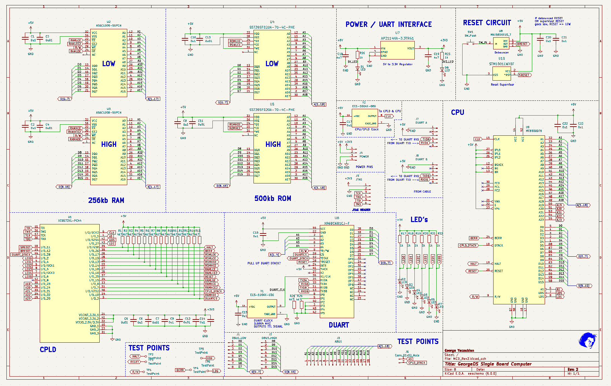
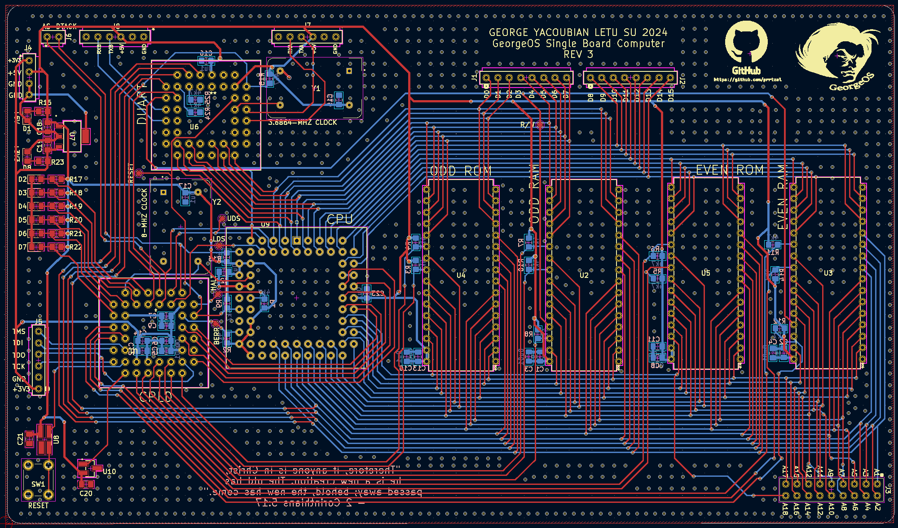
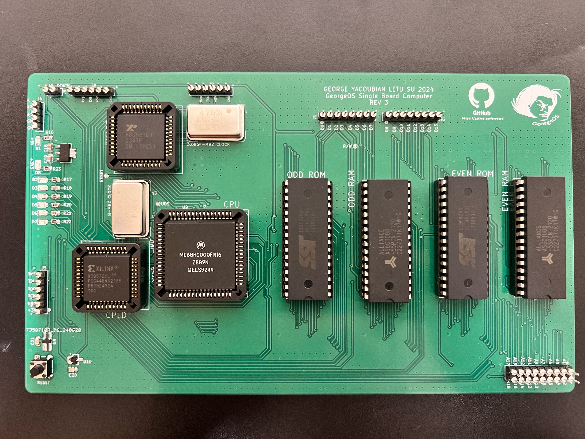

# GeorgeOS Single Board Computer

This was the final project for the Microcomputer Design Course at LeTourneau University.

Software for this project can be found here: [Morg Monitor Program](https://github.com/prrtzel/Morg-Monitor-Program)

The schematic and PCB designs can be viewed in detail using the 
[Kicanvas Online Viewer](https://kicanvas.org/?github=https%3A%2F%2Fgithub.com%2Fprrtzel%2FGeorgeOS-Single-Board-Computer%2Ftree%2Fmain%2FHardware%2FKiCAD)

The requirements for the project were as follows:

- Read from memory
- Write to memory
- Read from registers
- Write to registers
- Load an S-Record file
- Jump to the S-Record file and run it

## Schematic

## Printed Circuit Board

## Assembled Board

## Hardware Specifications
- Motorola 68000 32-bit CPU with an 8MHz clock speed
- Xilinx XC9572XL CPLD for address decoding / glue logic
- Dual channel UART interface for serial communication
